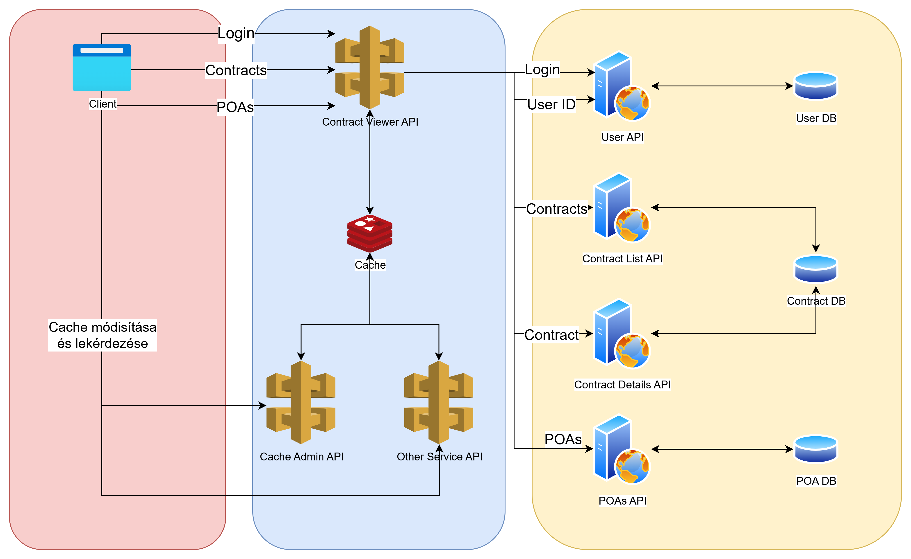

# A rendszer működése
## Architektúra
A rendszer számos párhuzamosan futó processből áll:

**Client:** Ez a böngészőben futó Angular kliens, egy sima frontend

**Contract Viewer API:** A kliens ezzel az apival kommunikál. Ez az api kommunikál a cache-el, illetve továbbítja a szükséges kéréseket a megfelelő API-nak. Habár az üzleti logika nem bonyolult, minden fontos logika a `ContractViewerApi/ContractViewerApi/ContractViewerEndpoints.cs` file-ban található.

**User API:** Ez egy mini alkalmazás, ami a user management-ért felelős. Számon tart egy olyan adatbázist, ami a usereket tárolja. A 2 fő funkcionalitás, amit megvalósít a bejelentkezés (Bearer tokennel) és a user ID lekérése token alapján.

**Contract List API és Contract Details API:** Ez a 2 mini alkalmazás ugyanazt a db-t használják, ami szerződéseket tárol. Az előbbi egy olyan endpointot implementál, ami user ID alapján kilistázza az adott userhez tartozó szerződéseket, az utóbbival pedig egy adott szerződés részleteit lehet lekérdezni.

**Document API:** Ez a mini alkalmazás egy olyan endpointot valósít meg, amivel több szerződés ID alapján lehet listázni az ezekhez tartozó dukomentumokat.

## Főbb folyamatok
A POC kipróbálásához be kell jelentkezni. Az előre definiált user-ek a `ContractViewerApi/UserApi/IdentitySeeder.Users.cs` file-ban találhatók. 

Bejelentkezéshez navigáljunk a böngészőben a localhost:4200/login oldalra, majd töltsük ki a login formot! A jelszó minden usernek Admin_123.

Bejelentkezés után a cache-be kerül a bejelentekezett userhez tartozó user id (Pontosabban a bejelentkezést követő első olyan művelet végrehajtásakor, amihez kell a user id). Ezt meg is tudjuk nézni a cache editorban, a jobb felső sarokban. Itt tetszőlegesen tudunk törölni cache adatokat és frissíteni a cache-t. 

## Contractok
A bejelentkezett felhasználó szerződései lekérdezésre kerülnek a `/contracts` oldal megnyitásakor. 

Ha a contractok az adott userhez már a cache-ben vannak, akkor ezeket jeleníti meg.

Ha a contractok nincsenek a cache-ben, de a user id igen, akkor az app ezt fogja használni a szerződések lekérdezésére. Ha egyik sincs, akkor le fogja kérdezni a bejelentkezett user id-ját, majd beteszi a cache-be, és ezt fogja használni a szerződések lekérdezésére, és azok is bekerülnek a cache-be. 

Az adott user-hez lehet véletlenszerűen generálni szerődéseket, hogy könnyen fel lehessen tölteni adattal. Ehhez, a '+' gombra kell rányomnunk a szerződések listázásakor.

## Dokumentumok
A `/documents` oldalon lehet lekérdezni az adott felhasználó összes szerződéséhez tartozó dokumentumot.

A dokumentumokat szerződés id-k listája alapján lehet lekérdezni.

Ehhez a backend lekérdezi az összes szerződést, ami a bejelentkezett userhez tartozik, majd ezek alapján keres a dokumentumokban. A cache-elési logika itt is érvényes, tehát ha a contractok az adott userben már benne vannak a cache-ben akkor azt használja, ha nem, akkor a fent leírt módon jár el a rendszer.

A dokumentumok a lekérdezésük után szintén bekerülnek a cache-be.

Az adott user-hez dokumentumokat is lehet véletlenszerűen generálni. Ehhez, a '+' gombra kell rányomnunk a dokumentumok listázásakor.

# Megjegyzések
Az alkalmazás mellékhatásként a gyökér mappában (windowson a C:\ mappában) létre fog hozni egy `shared-keys` nevű mappát. Ez szükséges ahhoz, hogy ugyanaz a token el legyen fogadva a központi API és a User API által is. Ezt a mappát az alkalmazás futtatása után szabadon törölhetjük